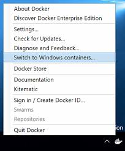

I had a .NET Core application that relied on WindowsAuthentication, and I wanted to deploy it using Docker.

Why?

Well, I hate the "It works on my Computer" situation but it does not work on other environments, and I wanted to learn more about Docker.

For this post, I am using a very simple app.

So in my case I created a folder `sampleAppWithWindowsAuth`. Ran `dotnet new webapp --auth Windows` inside that folder. I added a web.config file to enable WindowsAuthentication. After that I only needed to run `dotnet publish`. When it was built I copied the `publish` to the folder with the Dockerfile.

So the app was ready. Next step the **Dockerfile**.

I then started googling and found some information but not exactly what I needed so I started my own docker. 

The first step was switching my Docker Desktop environment to use Windows Containers, because I wanted to use WindowsAuthentication. WindowsAuthentication can run with Linux container but I still wanted to use IIS.



When I started my Desktop Environment was a Windows 10 1709, and I had a lot of issues. So you need to have either:
* Windows 10 1809 or later (for example I have version 1909)
* Window Server 2016 or later

> If you are unsure about your windows version you can use `(Get-ItemProperty -Path "HKLM:\SOFTWARE\Microsoft\Windows NT\CurrentVersion" -Name ReleaseId).ReleaseId` to get your version.

My initial docker started with this:

```Docker
# escape=`
FROM mcr.microsoft.com/windows/servercore/iis:latest
SHELL ["powershell", "-Command", "$ErrorActionPreference = 'Stop'; $ProgressPreference = 'Continue'; $verbosePreference='Continue';"]
```

> The `escape` is just for the powershell commands. 

> The [SHELL](https://docs.docker.com/engine/reference/builder/#shell) is used to specify how commands are executed. For example if I have a `RUN Write-Host hello` command with the previous `SHELL` instructions that means that the command will get executed as: `powershell -Command Write-Host hello ;$ErrorActionPreference = 'Stop'; $ProgressPreference = 'Continue'; $verbosePreference='Continue'`

At this point we have a docker base on Window Server Core + IIS. 


> At some point i had some issue with powershell, it seems like I needed to enable TLS. If it happens to you, you can issue this command: `[Net.ServicePointManager]::SecurityProtocol = [Net.SecurityProtocolType]::Tls12`

This sample is for Windows Authentication and that is Window Features. So the [`Install-WindowsFeature Web-Server;`](https://docs.microsoft.com/en-us/powershell/module/microsoft.windows.servermanager.migration/install-windowsfeature?view=win10-ps) is the quite obvious :) cmdlet. I added these lines:

```Docker
# Enable Windows Authentication
RUN Install-WindowsFeature Web-Windows-Auth
```

Next I needed to install the [.NET Core Hosting Bundle](https://dotnet.microsoft.com/download/dotnet-core/3.1) in order to [support running a .NET Core App in IIS](https://docs.microsoft.com/en-us/aspnet/core/host-and-deploy/iis/)

I found these lines to do that:
```Docker
# Install .NET Core
ENV DOTNET_VERSION 3.1.4
ENV DOTNET_DOWNLOAD_URL https://download.visualstudio.microsoft.com/download/pr/5bed16f2-fd1a-4027-bee3-3d6a1b5844cc/dd22ca2820fadb57fd5378e1763d27cd/dotnet-hosting-$DOTNET_VERSION-win.exe

ENV DOTNET_DOWNLOAD_SHA c4efac485e527240dc0e5b806eb1d06bf70d22193d68090a17f68d09806275214bf23450385fb71e725a2eed8b09c3e91cb582979678186f66a6cb563e5688c0
RUN Invoke-WebRequest $Env:DOTNET_DOWNLOAD_URL -OutFile WindowsHosting.exe; `
    if ((Get-FileHash WindowsHosting.exe -Algorithm sha512).Hash -ne $Env:DOTNET_DOWNLOAD_SHA) { `
        Write-Host 'CHECKSUM VERIFICATION FAILED!'; `
        exit 1; `
    }; `
    Start-Process "./WindowsHosting.exe" '/install /quiet /norestart' -Wait; `
    Remove-Item -Force -Recurse 'C:\ProgramData\Package Cache\*'; `
    Remove-Item -Force -Recurse C:\Windows\Installer\*; `
    Remove-Item -Force WindowsHosting.exe

RUN setx /M PATH $($Env:PATH + ';' + $Env:ProgramFiles + '\dotnet')
# Enable detection of running in a container
ENV DOTNET_RUNNING_IN_CONTAINER=true
```

Which in general:
* Download the .NET Core Hosting Bundle
* Check the Download Hash
* Run the installer
* And the remove it

At this point my container was almost ready. But I needed to setup the IIS so I could host my app. Instead of using the Default Application Pool, I prefer to delete and use my own.

```Docker
RUN Remove-Website -Name 'Default Web Site'; `
    New-WebAppPool -Name 'webapp'; `
    Set-ItemProperty IIS:\AppPools\webapp -Name managedRuntimeVersion -Value ''; `
    Set-ItemProperty IIS:\AppPools\webapp -Name enable32BitAppOnWin64 -Value 0; `
    Set-ItemProperty IIS:\AppPools\webapp -Name processModel -value @{identitytype='ApplicationPoolIdentity'}; `
    New-Website -Name 'webapp' `
                -Port 80 -PhysicalPath 'C:\webapp' `
                -ApplicationPool 'webapp' -force;  `
    & $env:windir\system32\inetsrv\appcmd.exe unlock config -section:system.webServer/security/authentication/windowsAuthentication;  `
    & $env:windir\system32\inetsrv\appcmd.exe unlock config -section:system.webServer/security/authentication/anonymousAuthentication
```

In my initial attempts I found that I needed to unlock the authentication sections to allow setting up Windows Authentication, which are those two last lines.

And finally I needed to copy my app (which I have previosly published and copied to a folder along my docker file)

```Docker
# Create a directory for the webapp and copy it
RUN mkdir c:\webapp
COPY .\published\ C:\webapp
```

Now lets build it:

```
docker build -t orellabac:WinAuthContainer .
```

Ok, now the image is ready. But are we ready now ?

Well almost. To run a docker container with Windows Authentication you need a gMSAAccount.

And I was!! 

[I looked up in microsoft docs](https://docs.microsoft.com/en-us/windows-server/security/group-managed-service-accounts/group-managed-service-accounts-overview) and it general these accounts are system accounts that are used for System services like IIS but they are handled in a way that they are not compromised. 

So I just asked my IT Dept to create one for me. Lets stay it was `WebApp01`.

Once they created it, I needed to start using it on my environment.

In windows 10 the first task is to install the RSAT tools.

> There are tools for managing roles and features that run on Windows Server.

Run an elevated powershell prompt and run:

```powershell
PS C:\Windows\system32> Add-WindowsCapability -Online -Name 'Rsat.ActiveDirectory.DS-LDS.Tools~~~~0.0.1.0'
```
When I did that I got an error message:
```
Add-WindowsCapability : Add-WindowsCapability failed. Error code = 0x800f0954
At line:1 char:1
+ Add-WindowsCapability -Online -Name 'Rsat.ActiveDirectory.DS-LDS.Tool ...
+ ~~~~~~~~~~~~~~~~~~~~~~~~~~~~~~~~~~~~~~~~~~~~~~~~~~~~~~~~~~~~~~~~~~~~~
    + CategoryInfo          : NotSpecified: (:) [Add-WindowsCapability], COMException
    + FullyQualifiedErrorId : Microsoft.Dism.Commands.AddWindowsCapabilityCommand
```

I then used the solution from this guy:
https://www.prajwaldesai.com/rsat-tools-installation-error-0x800f0954/


After installing the RSAT tools, you need you check your gMSAAccount. If you run
```
Test-ADServiceAccount WebApp01
```

it should return: `true`

Next you need to install it:
```
Install-ADServiceAccount -Identity WebApp01$
```

Next you need a **credential spec**:

> A credential spec file is a JSON document that contains metadata about the gMSA account(s) you want a container to use.

```
Install-Module CredentialSpec
```

> You might get asked to install a newer version of nuget. I just accepted all.

Next you need to create your credential spec:

```
New-CredentialSpec -AccountName WebApp01
```

It will show an output like:
```
Name                          Path
----                          ----
domain_account.json C:\ProgramData\Docker\CredentialSpecs\domain_account.json
```

You can list later your credential specs with `Get-CredentialSpec`

At this point you are ready.

You can now run your app with:
```
docker run --security-opt "credentialspec=file://artinsoft_webapp01.json" --hostname webapp01 -p 80:80 orellabac:WinAuthContainer
```